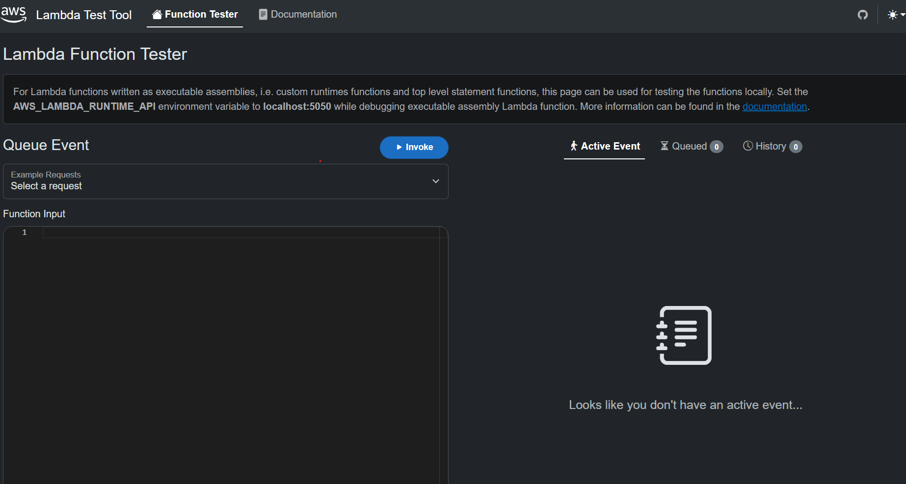

# AWS Lambda Test Tool

## Overview
The AWS Lambda Test Tool provides local testing capabilities for .NET Lambda functions with support for both Lambda emulation and API Gateway emulation. This tool allows developers to test their Lambda functions locally in three different modes:

1. Lambda Emulator Mode
2. API Gateway Emulator Mode
3. Combined Mode (both emulators)



## Comparison with Previous Test Tool

The AWS Lambda Test Tool is an evolution of the previous [AWS .NET Mock Lambda Test Tool](https://github.com/aws/aws-lambda-dotnet/tree/master/Tools/LambdaTestTool), with several key improvements:

### New Features
- **API Gateway Emulation**: Direct support for testing API Gateway integrations locally
- Updated to use a new flow for loading Lambda functions that mimics closer to the Lambda service. This solves many of the issues with the older tool when it came to loading dependencies.
- Ability to have multiple Lambda functions use the same instance of the test tool.
- UI refresh
- [Support for integration with .NET Aspire](https://github.com/aws/integrations-on-dotnet-aspire-for-aws/issues/17)

# AWS Lambda Test Tool

- [Overview](#overview)
- [Comparison with Previous Test Tool](#comparison-with-previous-test-tool)
    - [New Features](#new-features)
- [Getting help](#getting-help)
- [.NET Aspire integration](#net-aspire-integration)
- [Installing](#installing)
- [Running the Test Tool](#running-the-test-tool)
    - [Lambda Emulator Mode](#lambda-emulator-mode)
    - [API Gateway Emulator Mode](#api-gateway-emulator-mode)
        - [Required Configuration](#required-configuration)
    - [Combined Mode](#combined-mode)
- [Command Line Options](#command-line-options)
- [API Gateway Configuration](#api-gateway-configuration)
    - [Single Route Configuration](#single-route-configuration)
    - [Multiple Routes Configuration](#multiple-routes-configuration)
- [Example Lambda Function Setup](#example-lambda-function-setup)
    - [1. Lambda Function Code](#1-lambda-function-code)
        - [Option 1: Using Top-Level Statements](#option-1-using-top-level-statements)
        - [Option 2: Using Class Library](#option-2-using-class-library)
    - [2. AWS_LAMBDA_RUNTIME_API](#2-aws_lambda_runtime_api)
    - [3. API Gateway Configuration](#3-api-gateway-configuration)
    - [4. Testing the Function](#4-testing-the-function)

## Getting help

This tool is currently in preview and there are some known limitations. For questions and problems please open a GitHub issue in this repository.

## .NET Aspire integration
The easiest way to get started using the features of the new test tool is with .NET Aspire. The integration takes care of installing the tool and provides .NET Aspire extension methods for configuring your Lambda functions and API Gateway emulator in the .NET Aspire AppHost. It avoids all of the steps list below for installing the tooling and setting up environment variables.

Check out the following tracker issue for information on the .NET Aspire integration and steps for getting started. https://github.com/aws/integrations-on-dotnet-aspire-for-aws/issues/17

## Installing

The tool is distributed as .NET Global Tool. To install the tool execute the following command:

```
dotnet tool install -g amazon.lambda.testtool
```

To update the tool run the following command:

```
dotnet tool update -g amazon.lambda.testtool
```

## Running the Test Tool

### Lambda Emulator Mode
Use this mode when you want to test Lambda functions directly without API Gateway integration.

```
# Start Lambda emulator on port 5050
dotnet lambda-test-tool start --lambda-emulator-port 5050
```

### API Gateway Emulator Mode
Use this mode when you want to test Lambda functions through API Gateway endpoints. **Note: Running this mode by itself will not work, you will still need have the lambda runtime client running elsewhere and reference it in the `Endpoint` parameter in the `APIGATEWAY_EMULATOR_ROUTE_CONFIG` env varible (see below [Required Configuration](#required-configuration))** Api gateway mode requires additional configuration through environment variables.

```
# Start API Gateway emulator on port 5051 in REST mode
dotnet lambda-test-tool start \
    --api-gateway-emulator-port 5051 \
    --api-gateway-emulator-mode Rest

```
#### Required Configuration
When running via command line, you must set the environment variable for API Gateway route configuration:

Linux/macOS:
```bash
export APIGATEWAY_EMULATOR_ROUTE_CONFIG='{"LambdaResourceName":"AddLambdaFunction","HttpMethod":"Get","Path":"/add/{x}/{y}","Endpoint":"{LAMBDA_RUNTIME_API}"}'

```

Windows (Command Prompt):

```
set APIGATEWAY_EMULATOR_ROUTE_CONFIG={"LambdaResourceName":"AddLambdaFunction","HttpMethod":"Get","Path":"/add/{x}/{y}","Endpoint":"{LAMBDA_RUNTIME_API}"}

```

Windows (PowerShell):

```
$env:APIGATEWAY_EMULATOR_ROUTE_CONFIG='{"LambdaResourceName":"AddLambdaFunction","HttpMethod":"Get","Path":"/add/{x}/{y}","Endpoint":"{LAMBDA_RUNTIME_API}"}'

```

Replace `{LAMBDA_RUNTIME_API}` with your Lambda runtime API endpoint (e.g., "http://localhost:5050/AddLambdaFunction" or the endpoint specified in your `AWS_LAMBDA_RUNTIME_API` environment variable).


### Combined Mode
Use this mode when you want to run both Lambda and API Gateway emulators simultaneously.

```
# Start both emulators
dotnet lambda-test-tool start \
    --lambda-emulator-port 5050 \
    --api-gateway-emulator-port 5051 \
    --api-gateway-emulator-mode Rest
```

## Command Line Options
| Option | Description | Required For |
|--------|-------------|--------------|
| `--lambda-emulator-port` | Port for Lambda emulator | Lambda Mode |
| `--lambda-emulator-host` | Host for Lambda emulator | Lambda Mode |
| `--api-gateway-emulator-port` | Port for API Gateway | API Gateway Mode |
| `--api-gateway-emulator-mode` | API Gateway mode (Rest/HttpV1/HttpV2) | API Gateway Mode |
| `--no-launch-window` | Disable auto-launching web interface | Optional |
| `--config-storage-path` | Path for saving settings and requests | Optional |


## API Gateway Configuration
When using API Gateway mode, you need to configure the route mapping using the APIGATEWAY_EMULATOR_ROUTE_CONFIG environment variable. This can be a single route or an array of routes:

### Single Route Configuration
```
{
    "LambdaResourceName": "AddLambdaFunction",
    "HttpMethod": "Get",
    "Path": "/add/{x}/{y}"
}
```

### Multiple Routes Configuration

```
[
    {
        "LambdaResourceName": "AddLambdaFunction",
        "HttpMethod": "Get",
        "Path": "/add/{x}/{y}"
    },
    {
        "LambdaResourceName": "SubtractLambdaFunction",
        "HttpMethod": "Get",
        "Path": "/minus/{x}/{y}"
    }
]

```


#### Wildcard Paths
The API Gateway emulator supports the use of wildcard path. To define a wildcard path, you can use the `{proxy+}` syntax in the route pattern. See [here](https://docs.aws.amazon.com/apigateway/latest/developerguide/set-up-lambda-proxy-integrations.html) for a more detailed explanation on how proxies work.

Here's an example of how to set up an API Gateway emulator with a wildcard path:

```
[
    {
        "LambdaResourceName": "RootFunction",
        "HttpMethod": "Get",
        "Path": "/root"
    },
    {
        "LambdaResourceName": "MyOtherLambdaFunction",
        "HttpMethod": "Get",
        "Path": "/root/{proxy+}"
    }
]

```

This JSON configuration sets up two API Gateway resources:

1. `/root` that is mapped to the `RootFunction` Lambda function.
2. `/root/{proxy+}` that is a proxy resource mapped to the `MyOtherLambdaFunction` Lambda function.

The `{proxy+}` syntax in the second path allows the API Gateway to proxy any additional path segments to the integrated Lambda function.

## Example Lambda Function Setup

Here's a simple Lambda function that adds two numbers together.

### 1. Lambda Function Code
This can be implemented in two ways:

#### Option 1: Using Top-Level Statements


```csharp
using Amazon.Lambda.APIGatewayEvents;
using Amazon.Lambda.Core;
using Amazon.Lambda.RuntimeSupport;
using Amazon.Lambda.Serialization.SystemTextJson;

var Add = (APIGatewayHttpApiV2ProxyRequest request, ILambdaContext context) =>
{
    // Parse x and y from the path parameters
    var x = int.Parse(request.PathParameters["x"]);
    var y = int.Parse(request.PathParameters["y"]);
    return (x + y).ToString();
};

await LambdaBootstrapBuilder.Create(Add, new CamelCaseLambdaJsonSerializer())
    .Build()
    .RunAsync();

```

Configure the Lambda function to use the test tool:

**Properties/launchSettings.json**
```
{
  "profiles": {
    "AspireTestFunction": {
      "commandName": "Project",
      "environmentVariables": {
        "AWS_LAMBDA_RUNTIME_API": "localhost:5050/AddLambdaFunction"
      }
    }
  }
}
```

#### Option 2: Using Class Library
```
using Amazon.Lambda.APIGatewayEvents;
using Amazon.Lambda.Core;

namespace MyLambdaFunction;

public class Function
{
    public int Add(APIGatewayHttpApiV2ProxyRequest request, ILambdaContext context)
    {
        var x = int.Parse(request.PathParameters["x"]);
        var y = int.Parse(request.PathParameters["y"]);
        return x + y;
    }
}
```

Configure the Lambda function to use the test tool:

**Properties/launchSettings.json**
```
{
  "profiles": {
    "LambdaRuntimeClient_FunctionHandler": {
      "workingDirectory": ".\\bin\\$(Configuration)\\net8.0",
      "commandName": "Executable",
      "commandLineArgs": "exec --depsfile ./MyLambdaFunction.deps.json  --runtimeconfig ./MyLambdaFunction.runtimeconfig.json %USERPROFILE%/.dotnet/tools/.store/amazon.lambda.testtool/{TEST_TOOL_VERSION}/amazon.lambda.testtool/{TEST_TOOL_VERSION}/content/Amazon.Lambda.RuntimeSupport/{TARGET_FRAMEWORK}/Amazon.Lambda.RuntimeSupport.dll MyLambdaFunction::MyLambdaFunction.Function::Add",
      "executablePath": "dotnet",
      "environmentVariables": {
        "AWS_LAMBDA_RUNTIME_API": "localhost:5050/AddLambdaFunction"
      }
    }
  }
}
```

There are three variables you may need to replace:

There are three variables you need to update in the launch settings:

1. `{TEST_TOOL_VERSION}` - Replace with the current Amazon.Lambda.TestTool version (e.g., `0.0.3` in the example above)
   - This appears in the path: `.store/amazon.lambda.testtool/{TEST_TOOL_VERSION}/amazon.lambda.testtool/{TEST_TOOL_VERSION}/content/`

2. `{TARGET_FRAMEWORK}` - Replace with your Lambda project's target framework version (e.g., `net8.0` in the example above)
   - This appears in two places:
     - The working directory: `.\\bin\\$(Configuration)\\{TARGET_FRAMEWORK}`
     - The runtime support DLL path: `Amazon.Lambda.RuntimeSupport/{TARGET_FRAMEWORK}/Amazon.Lambda.RuntimeSupport.dll`

3. `{FUNCTION_HANDLER}` - Replace with your function's handler using the format: `<project_name>::<namespace>.<class>::<method_name>`
   - Example: `MyLambdaFunction::MyLambdaFunction.Function::Add`


### 2. AWS_LAMBDA_RUNTIME_API

The `AWS_LAMBDA_RUNTIME_API` environment variable tells the Lambda function where to find the Lambda runtime API endpoint. It has the following format:

`host:port/functionName`


The host and port should match the port that the lambda emulator is running on.
In this example we will be running the lambda runtime api emulator on `localhost` on port `5050` and our function name will be `AddLambdaFunction`. **Warning**: You should *not* add `http://` prefix to the host (if you do the lambda will fail to connect).

### 3. API Gateway Configuration
To expose this Lambda function through API Gateway, set the APIGATEWAY_EMULATOR_ROUTE_CONFIG:

```
{
    "LambdaResourceName": "AddLambdaFunction",
    "HttpMethod": "GET",
    "Path": "/add/{x}/{y}"
}
```

### 4. Testing the Function
1. Start the test tool with both Lambda and API Gateway emulators:
```
dotnet lambda-test-tool start \
    --lambda-emulator-port 5050 \
    --api-gateway-emulator-port 5051 \
    --api-gateway-emulator-mode HTTPV2

```
2. Send a test request:
```
curl -X GET "http://localhost:5051/add/5/3" -H "Content-Type: application/json" -d '"hello world"'
```

Expected response:
```
8
```

## Saving Lambda Requests

The Test Tool provides users with the ability to save Lambda requests for quick access. Saved requests will be listed in a drop down above the request input area.

In order to enable saving requests, you will need to provide a storage path during the test tool startup. 

You can use the command line argument `--config-storage-path <absolute-path>` to specify the storage path.