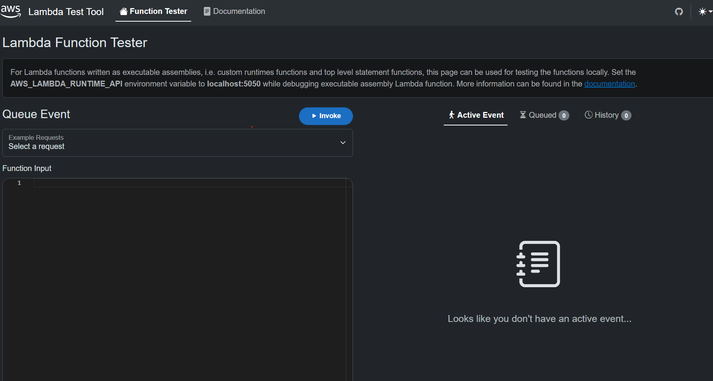

# AWS Lambda Test Tool

Test and debug your .NET AWS Lambda functions locally. The tool runs a local Lambda Runtime API emulator (so your function connects to it exactly as it would in the cloud), an optional API Gateway emulator, and optional SQS / DynamoDB Streams event sources — all driven from a web UI.



> **Preview:** This tool is in preview. See [Known Limitations](#known-limitations). For questions and problems, please [open a GitHub issue](https://github.com/aws/aws-lambda-dotnet/issues).

## Table of Contents

- [Quick Start](#quick-start)
- [Prerequisites](#prerequisites)
- [Features](#features)
- [Installing](#installing)
- [Running the Test Tool](#running-the-test-tool)
  - [Lambda Emulator Mode](#lambda-emulator-mode)
  - [API Gateway Emulator Mode](#api-gateway-emulator-mode)
  - [Combined Mode](#combined-mode)
- [Command Line Options](#command-line-options)
- [Using the Web UI](#using-the-web-ui)
  - [Built-in Sample Events](#built-in-sample-events)
  - [Saving Requests](#saving-requests)
  - [Light / Dark Theme](#light--dark-theme)
- [API Gateway Configuration](#api-gateway-configuration)
  - [Single Route](#single-route)
  - [Multiple Routes](#multiple-routes)
  - [Wildcard Paths](#wildcard-paths)
- [Event Sources](#event-sources)
  - [SQS Event Source](#sqs-event-source)
  - [DynamoDB Streams Event Source](#dynamodb-streams-event-source)
- [Example Lambda Function Setup](#example-lambda-function-setup)
  - [Option 1: Top-Level Statements](#option-1-top-level-statements)
  - [Option 2: Class Library](#option-2-class-library)
  - [The AWS_LAMBDA_RUNTIME_API Environment Variable](#the-aws_lambda_runtime_api-environment-variable)
- [Sample Projects](#sample-projects)
- [.NET Aspire Integration](#net-aspire-integration)
- [Troubleshooting](#troubleshooting)
- [Known Limitations](#known-limitations)
- [What's New Compared to the Previous Test Tool](#whats-new-compared-to-the-previous-test-tool)
- [Getting Help](#getting-help)

## Quick Start

This gets you from install to a working local invocation in about five minutes, testing a Lambda function through the API Gateway emulator.

**1. Install the tool** (see [Prerequisites](#prerequisites) if `dotnet` commands aren't found):

```
dotnet tool install -g amazon.lambda.testtool
```

**2. Create a Lambda function** that adds two numbers. This uses the AWS Lambda project templates (install once with `dotnet new install Amazon.Lambda.Templates`), or skip ahead and clone [`samples/AddFunctionTopLevel`](samples/AddFunctionTopLevel) instead:

```
dotnet new lambda.EmptyFunction --name AddLambdaFunction
cd AddLambdaFunction/src/AddLambdaFunction
```

Replace the contents of `Function.cs` with a top-level-statements handler:

```csharp
using Amazon.Lambda.APIGatewayEvents;
using Amazon.Lambda.Core;
using Amazon.Lambda.RuntimeSupport;
using Amazon.Lambda.Serialization.SystemTextJson;

var handler = (APIGatewayHttpApiV2ProxyRequest request, ILambdaContext context) =>
{
    var x = int.Parse(request.PathParameters["x"]);
    var y = int.Parse(request.PathParameters["y"]);
    return (x + y).ToString();
};

await LambdaBootstrapBuilder.Create(handler, new CamelCaseLambdaJsonSerializer())
    .Build()
    .RunAsync();
```

Add the packages the handler uses:

```
dotnet add package Amazon.Lambda.RuntimeSupport
dotnet add package Amazon.Lambda.APIGatewayEvents
```

**3. Tell the function where the local runtime API is.** Add a launch profile to `Properties/launchSettings.json`:

```json
{
  "profiles": {
    "AddLambdaFunction": {
      "commandName": "Project",
      "environmentVariables": {
        "AWS_LAMBDA_RUNTIME_API": "localhost:5050/AddLambdaFunction"
      }
    }
  }
}
```

**4. Configure the API Gateway route** the emulator will expose. Set this environment variable in the terminal you'll start the test tool from:

```bash
# Linux/macOS
export APIGATEWAY_EMULATOR_ROUTE_CONFIG='{"LambdaResourceName":"AddLambdaFunction","HttpMethod":"Get","Path":"/add/{x}/{y}","Endpoint":"http://localhost:5050"}'
```

```powershell
# Windows (PowerShell)
$env:APIGATEWAY_EMULATOR_ROUTE_CONFIG='{"LambdaResourceName":"AddLambdaFunction","HttpMethod":"Get","Path":"/add/{x}/{y}","Endpoint":"http://localhost:5050"}'
```

**5. Start the test tool** with both the Lambda and API Gateway emulators (in the terminal from step 4):

```
dotnet lambda-test-tool start --lambda-emulator-port 5050 --api-gateway-emulator-port 5051 --api-gateway-emulator-mode HttpV2
```

**6. Start your function** (in a separate terminal, from the function directory):

```
dotnet run --launch-profile AddLambdaFunction
```

**7. Invoke it** through the API Gateway emulator:

```
curl "http://localhost:5051/add/5/3"
```

Expected response:

```
8
```

> A ready-made version of this walkthrough lives in [`samples/AddFunctionTopLevel`](samples/AddFunctionTopLevel). See [Sample Projects](#sample-projects).

## Prerequisites

- **.NET SDK 8.0 or later.** The tool targets `net8.0` and `net10.0` and rolls forward, so a .NET 8, 9, or 10 SDK works. Verify with `dotnet --version`.
- **The .NET global tools directory must be on your `PATH`.** `dotnet tool install -g` installs to `~/.dotnet/tools` (Linux/macOS) or `%USERPROFILE%\.dotnet\tools` (Windows). If `dotnet lambda-test-tool` reports "command not found" after installing, add that directory to your `PATH` and open a new terminal.
- Verify the install with `dotnet lambda-test-tool info`, which prints the installed version and path.

## Features

- **Lambda Runtime API emulator** — run and debug any .NET Lambda function locally; it connects to the emulator exactly as it would to the real Lambda service.
- **API Gateway emulator** — test functions through REST, HTTP API v1, or HTTP API v2 request/response shapes.
- **SQS and DynamoDB Streams event sources** — poll a real queue or table stream and invoke your function with batched events.
- **Web UI** — pick or edit an event, invoke, inspect the response, and re-invoke from history.
- **58 built-in sample events** — S3, SQS, SNS, DynamoDB, API Gateway, CloudWatch, Kinesis, Alexa, Lex, and more, available directly in the UI.
- **Saved requests** — save and reuse request payloads across sessions.
- **Light / dark theme.**
- **[.NET Aspire integration](#net-aspire-integration)** — for a lower-configuration setup.

## Installing

The tool is distributed as a .NET Global Tool:

```
dotnet tool install -g amazon.lambda.testtool
```

To update:

```
dotnet tool update -g amazon.lambda.testtool
```

To confirm the installed version and location (useful for the class-library setup below):

```
dotnet lambda-test-tool info
```

## Running the Test Tool

The test tool can run the Lambda emulator, the API Gateway emulator, or both.

### Lambda Emulator Mode

Use this mode to invoke Lambda functions directly (via the web UI or the SDK), without API Gateway. This is the simplest way to test event-driven functions (S3, SQS, custom events).

```
# Start the Lambda emulator on port 5050
dotnet lambda-test-tool start --lambda-emulator-port 5050
```

The web UI opens automatically. Point your function at the emulator with the [`AWS_LAMBDA_RUNTIME_API`](#the-aws_lambda_runtime_api-environment-variable) environment variable, then invoke it from the UI.

### API Gateway Emulator Mode

Use this mode to test functions through API Gateway endpoints.

> **The API Gateway emulator does not run your function.** It forwards requests to a Lambda Runtime API endpoint that must already be running — either the Lambda emulator (Combined Mode below) or one you point at with the route config's `Endpoint`. Running this mode by itself will not invoke anything.

```
dotnet lambda-test-tool start --api-gateway-emulator-port 5051 --api-gateway-emulator-mode HttpV2
```

You must also set the `APIGATEWAY_EMULATOR_ROUTE_CONFIG` environment variable to map routes to functions — see [API Gateway Configuration](#api-gateway-configuration).

> **Choose the mode to match your handler.** `Rest`, `HttpV1`, and `HttpV2` differ in the request event shape and how the response is interpreted. A handler taking `APIGatewayHttpApiV2ProxyRequest` (like the Quick Start) must use `HttpV2`; `APIGatewayProxyRequest` is used by `Rest` and `HttpV1`. A mismatch typically produces an HTTP 502. `HttpV2` is the default if `--api-gateway-emulator-mode` is omitted.

### Combined Mode

Run both emulators together — the API Gateway emulator forwards to the Lambda emulator automatically. This is the most common setup.

```
dotnet lambda-test-tool start \
    --lambda-emulator-port 5050 \
    --api-gateway-emulator-port 5051 \
    --api-gateway-emulator-mode HttpV2
```

## Command Line Options

All options belong to the `start` command (`dotnet lambda-test-tool start ...`).

| Option | Description | Default |
|--------|-------------|---------|
| `-p`, `--lambda-emulator-port <PORT>` | Port for the Lambda emulator / web UI. If set, the Lambda emulator starts. | — |
| `--lambda-emulator-host <HOST>` | Host for the web UI. Any value other than an IP or `localhost` (e.g. `*`, `+`) binds to all public addresses. | `localhost` |
| `--lambda-emulator-https-port <PORT>` | HTTPS port for the web UI. Requires certs configured for the host. | — |
| `--api-gateway-emulator-port <PORT>` | Port for the API Gateway emulator. If set, the emulator starts (requires `--api-gateway-emulator-mode`). | — |
| `--api-gateway-emulator-mode <MODE>` | API Gateway mode: `Rest`, `HttpV1`, or `HttpV2`. | `HttpV2` |
| `--api-gateway-emulator-https-port <PORT>` | HTTPS port for the API Gateway emulator. Requires certs configured for the host. | — |
| `--sqs-eventsource-config <CONFIG>` | Configure an [SQS event source](#sqs-event-source). | — |
| `--dynamodbstreams-eventsource-config <CONFIG>` | Configure a [DynamoDB Streams event source](#dynamodb-streams-event-source). | — |
| `--no-launch-window` | Do not auto-launch the web UI in a browser. | off |
| `--config-storage-path <PATH>` | Absolute path for [saving settings and requests](#saving-requests). | — |

The tool also has an `info` command:

```
dotnet lambda-test-tool info [--format Text|Json]
```

It prints the installed `Version` and `InstallPath`. `--format` defaults to `Text`.

## Using the Web UI

When the Lambda emulator starts, the web UI opens automatically (disable with `--no-launch-window`). It's the primary way to invoke and debug functions — no `curl` required.

The typical flow:

1. **Select the function** to invoke (the "Switch function" control lists every function connected to the emulator).
2. **Provide the event** in the Function Input editor. Type/paste JSON, or pick a [built-in sample event](#built-in-sample-events) or a [saved request](#saving-requests) from the dropdown.
3. **Invoke** the function. The request moves through the **Active Event**, **Queued**, and **History** tabs.
4. **Inspect the response** in the request/response dialog — the response body or the error and stack trace if the function threw.
5. **Re-Invoke** any past request from History, or **Clear** the queue/history.

### Built-in Sample Events

The tool ships **58 sample event payloads** (S3, SQS, SNS, DynamoDB, API Gateway, CloudWatch Logs, Kinesis, Alexa, Lex, CloudFront, and more), available from the "Example Requests" dropdown above the Function Input editor. Pick one to populate the editor with a realistic event instead of hand-writing JSON — the fastest way to test an event-driven handler.

### Saving Requests

You can save request payloads for quick reuse. Saved requests appear in a dropdown above the Function Input editor, and the UI provides:

- A **Save** dialog to name and store the current input.
- A **Manage Saved Requests** dialog to delete saved requests.
- Toggles to show/hide the sample events, saved requests, and the requests list.

Saving is only enabled when you provide a storage path at startup, because requests are persisted to disk there:

```
dotnet lambda-test-tool start --lambda-emulator-port 5050 --config-storage-path <absolute-path>
```

### Light / Dark Theme

The UI has a light/dark theme switcher in the top navigation. Your choice persists across sessions (when a `--config-storage-path` is configured).

## API Gateway Configuration

When using the API Gateway emulator, map routes to functions with the `APIGATEWAY_EMULATOR_ROUTE_CONFIG` environment variable. Each route has:

- `LambdaResourceName` — the function name (matches the name in `AWS_LAMBDA_RUNTIME_API`).
- `HttpMethod` — e.g. `Get`, `Post` (matched case-insensitively).
- `Path` — the route template, e.g. `/add/{x}/{y}`.
- `Endpoint` — the **base URL** of the Lambda Runtime API, e.g. `http://localhost:5050`. Do **not** append the function name here; that comes from `LambdaResourceName`. In Combined Mode this is the Lambda emulator's address.

The value can be a single route object or an array of routes.

### Single Route

```json
{
    "LambdaResourceName": "AddLambdaFunction",
    "HttpMethod": "Get",
    "Path": "/add/{x}/{y}",
    "Endpoint": "http://localhost:5050"
}
```

### Multiple Routes

```json
[
    {
        "LambdaResourceName": "AddLambdaFunction",
        "HttpMethod": "Get",
        "Path": "/add/{x}/{y}",
        "Endpoint": "http://localhost:5050"
    },
    {
        "LambdaResourceName": "SubtractLambdaFunction",
        "HttpMethod": "Get",
        "Path": "/minus/{x}/{y}",
        "Endpoint": "http://localhost:5050"
    }
]
```

> **Setting the variable on Windows Command Prompt:** quote the whole assignment so special characters are preserved:
> ```
> set "APIGATEWAY_EMULATOR_ROUTE_CONFIG={"LambdaResourceName":"AddLambdaFunction","HttpMethod":"Get","Path":"/add/{x}/{y}","Endpoint":"http://localhost:5050"}"
> ```

### Wildcard Paths

Use the `{proxy+}` syntax to proxy any additional path segments to a function. See the [API Gateway proxy integration docs](https://docs.aws.amazon.com/apigateway/latest/developerguide/set-up-lambda-proxy-integrations.html) for details.

```json
[
    {
        "LambdaResourceName": "RootFunction",
        "HttpMethod": "Get",
        "Path": "/root",
        "Endpoint": "http://localhost:5050"
    },
    {
        "LambdaResourceName": "MyOtherLambdaFunction",
        "HttpMethod": "Get",
        "Path": "/root/{proxy+}",
        "Endpoint": "http://localhost:5050"
    }
]
```

This maps `/root` to `RootFunction` and any deeper path (e.g. `/root/a/b`) to `MyOtherLambdaFunction`.

## Event Sources

The tool can poll a real AWS SQS queue or DynamoDB table stream and invoke your function with the batched events, mirroring how Lambda event source mappings work. These use real AWS credentials (via the `Profile`/`Region` keys or your default credential chain).

### SQS Event Source

Long-polls a queue, batches messages into an `SQSEvent`, invokes the function, and deletes messages on success (honoring partial-batch failures via `SQSBatchResponse`).

```
dotnet lambda-test-tool start \
    --lambda-emulator-port 5050 \
    --sqs-eventsource-config "QueueUrl=<queue-url>,FunctionName=<function-name>,VisibilityTimeout=100"
```

The config is a comma-delimited list of key pairs. Supported keys:

| Key | Description |
|-----|-------------|
| `QueueUrl` | The queue to poll. |
| `FunctionName` | Function to invoke. Defaults to the current emulator's function. |
| `BatchSize` | Max messages per batch. |
| `VisibilityTimeout` | Visibility timeout (seconds) for received messages. |
| `DisableMessageDelete` | If `true`, don't delete messages after a successful invoke. |
| `LambdaRuntimeApi` | Runtime API endpoint if the function runs outside this instance. |
| `Region` | AWS region of the queue. |
| `Profile` | AWS profile for credentials. |

### DynamoDB Streams Event Source

Resolves the table's latest stream, discovers shards, and polls for records to invoke your function.

```
dotnet lambda-test-tool start \
    --lambda-emulator-port 5050 \
    --dynamodbstreams-eventsource-config "TableName=<table-name>,FunctionName=<function-name>,BatchSize=100"
```

The config accepts comma-delimited key pairs, a JSON object, a JSON array, or a path to a JSON file. Supported keys:

| Key | Description |
|-----|-------------|
| `TableName` | The table whose stream to poll. |
| `FunctionName` | Function to invoke. Defaults to the current emulator's function. |
| `BatchSize` | Max records per batch. |
| `PollingIntervalMs` | Delay between polls, in milliseconds. |
| `LambdaRuntimeApi` | Runtime API endpoint if the function runs outside this instance. |
| `Region` | AWS region of the table. |
| `Profile` | AWS profile for credentials. |

## Example Lambda Function Setup

A function can be wired to the test tool in two ways. Option 1 is the lowest-friction path and is recommended for getting started.

### Option 1: Top-Level Statements

The handler is the entry point, launched with a simple `Project` launch profile.

```csharp
using Amazon.Lambda.APIGatewayEvents;
using Amazon.Lambda.Core;
using Amazon.Lambda.RuntimeSupport;
using Amazon.Lambda.Serialization.SystemTextJson;

var handler = (APIGatewayHttpApiV2ProxyRequest request, ILambdaContext context) =>
{
    var x = int.Parse(request.PathParameters["x"]);
    var y = int.Parse(request.PathParameters["y"]);
    return (x + y).ToString();
};

await LambdaBootstrapBuilder.Create(handler, new CamelCaseLambdaJsonSerializer())
    .Build()
    .RunAsync();
```

**Properties/launchSettings.json**

```json
{
  "profiles": {
    "AddLambdaFunction": {
      "commandName": "Project",
      "environmentVariables": {
        "AWS_LAMBDA_RUNTIME_API": "localhost:5050/AddLambdaFunction"
      }
    }
  }
}
```

Run it with `dotnet run --launch-profile AddLambdaFunction`. A complete project is in [`samples/AddFunctionTopLevel`](samples/AddFunctionTopLevel).

### Option 2: Class Library

For a class-library function (a handler method rather than top-level statements), you run the function assembly under the test tool's copy of the Lambda runtime support library. This works the same whether you launch it from the command line or an IDE.

```csharp
using Amazon.Lambda.APIGatewayEvents;
using Amazon.Lambda.Core;

namespace MyLambdaFunction;

public class Function
{
    public int Add(APIGatewayHttpApiV2ProxyRequest request, ILambdaContext context)
    {
        var x = int.Parse(request.PathParameters["x"]);
        var y = int.Parse(request.PathParameters["y"]);
        return x + y;
    }
}
```

**1. Make sure dependencies land in the build output.** A class library doesn't copy its NuGet dependencies (e.g. `Amazon.Lambda.Core.dll`) next to the output DLL by default, so add this to the `.csproj`:

```xml
<PropertyGroup>
  <CopyLocalLockFileAssemblies>true</CopyLocalLockFileAssemblies>
</PropertyGroup>
```

**2. Build the function** so the `.deps.json` / `.runtimeconfig.json` exist and dependencies are copied:

```
dotnet build
```

#### Run it from the command line

Set [`AWS_LAMBDA_RUNTIME_API`](#the-aws_lambda_runtime_api-environment-variable), then launch the function assembly under the test tool's runtime support shim. From the build output directory (e.g. `bin/Debug/net8.0`):

```bash
# Linux/macOS
export AWS_LAMBDA_RUNTIME_API="localhost:5050/AddLambdaFunction"

dotnet exec \
    --depsfile ./MyLambdaFunction.deps.json \
    --runtimeconfig ./MyLambdaFunction.runtimeconfig.json \
    "$HOME/.dotnet/tools/.store/amazon.lambda.testtool/{TEST_TOOL_VERSION}/amazon.lambda.testtool/{TEST_TOOL_VERSION}/content/Amazon.Lambda.RuntimeSupport/{TARGET_FRAMEWORK}/Amazon.Lambda.RuntimeSupport.TestTool.dll" \
    "{FUNCTION_HANDLER}"
```

On Windows (PowerShell), the shim path is under `$env:USERPROFILE\.dotnet\tools\.store\...`.

Replace the three placeholders:

1. **`{TEST_TOOL_VERSION}`** — your installed test tool version (appears **twice** in the `.store` path). Find it with `dotnet lambda-test-tool info` or `dotnet tool list -g`.
2. **`{TARGET_FRAMEWORK}`** — your Lambda project's target framework, e.g. `net8.0`.
3. **`{FUNCTION_HANDLER}`** — your handler in the form `<assembly>::<namespace>.<class>::<method>`, e.g. `MyLambdaFunction::MyLambdaFunction.Function::Add`.

> The runtime support assembly is named `Amazon.Lambda.RuntimeSupport.TestTool.dll` (not `Amazon.Lambda.RuntimeSupport.dll`) to avoid conflicting with the version your function already references.

#### Run it from an IDE (Visual Studio / Rider)

If you'd rather press F5, add a launch profile. This wraps the same `dotnet exec` command; the IDE expands `$(Configuration)` and resolves `workingDirectory` for you (plain `dotnet run --launch-profile` does not, so use the command-line form above outside an IDE).

**Properties/launchSettings.json**

```json
{
  "profiles": {
    "LambdaTestTool": {
      "commandName": "Executable",
      "executablePath": "dotnet",
      "workingDirectory": ".\\bin\\$(Configuration)\\{TARGET_FRAMEWORK}",
      "commandLineArgs": "exec --depsfile ./MyLambdaFunction.deps.json --runtimeconfig ./MyLambdaFunction.runtimeconfig.json %USERPROFILE%/.dotnet/tools/.store/amazon.lambda.testtool/{TEST_TOOL_VERSION}/amazon.lambda.testtool/{TEST_TOOL_VERSION}/content/Amazon.Lambda.RuntimeSupport/{TARGET_FRAMEWORK}/Amazon.Lambda.RuntimeSupport.TestTool.dll {FUNCTION_HANDLER}",
      "environmentVariables": {
        "AWS_LAMBDA_RUNTIME_API": "localhost:5050/AddLambdaFunction"
      }
    }
  }
}
```

The same three placeholders apply. On **Linux/macOS**, replace `%USERPROFILE%` with `$HOME`/`~` and use forward slashes throughout the `workingDirectory`.

A complete, build-verified example is in [`samples/AddFunctionClassLibrary`](samples/AddFunctionClassLibrary).

### The AWS_LAMBDA_RUNTIME_API Environment Variable

This variable tells your function where the Lambda Runtime API emulator is. Its format is:

```
host:port/functionName
```

The host and port must match the Lambda emulator (`--lambda-emulator-port`). In the examples above the emulator runs on `localhost:5050` and the function name is `AddLambdaFunction`, so the value is `localhost:5050/AddLambdaFunction`.

> **Do not add an `http://` prefix** to this value — the function will fail to connect if you do. (This differs from the API Gateway route config's `Endpoint`, which *does* include `http://`.)

## Sample Projects

Runnable starter projects live under [`samples/`](samples). Each has its own README with exact run steps.

| Sample | What it shows |
|--------|---------------|
| [`AddFunctionTopLevel`](samples/AddFunctionTopLevel) | The Quick Start: top-level-statements function behind the API Gateway emulator. |
| [`AddFunctionClassLibrary`](samples/AddFunctionClassLibrary) | A class-library function with a pre-filled `Executable` launch profile. |
| [`SQSProcessor`](samples/SQSProcessor) | An `SQSEvent` handler for the SQS event source (and the built-in `sqs.json` sample event). |
| [`ToUpperFunction`](samples/ToUpperFunction) | A minimal, zero-dependency function for exploring the web UI and sample events. |

## .NET Aspire Integration

If you use [.NET Aspire](https://learn.microsoft.com/dotnet/aspire/), the AWS integration installs the test tool for you and provides extension methods to configure your Lambda functions and API Gateway emulator in the Aspire AppHost — avoiding the manual install and environment-variable setup described above.

See the [.NET Aspire integration tracker](https://github.com/aws/integrations-on-dotnet-aspire-for-aws/issues/17) for status and setup steps.

## Troubleshooting

| Symptom | Cause / Fix |
|---------|-------------|
| `dotnet lambda-test-tool: command not found` | The .NET global tools directory isn't on your `PATH`. See [Prerequisites](#prerequisites), then open a new terminal. |
| Function won't connect to the runtime API | Don't put `http://` in `AWS_LAMBDA_RUNTIME_API`; use `host:port/functionName`. |
| API Gateway requests do nothing / time out | The API Gateway emulator doesn't run your function. Use [Combined Mode](#combined-mode) or point `Endpoint` at a running Lambda Runtime API. |
| HTTP 502 from the API Gateway emulator | The emulator mode doesn't match your handler's request/response type. Match `Rest`/`HttpV1`/`HttpV2` to your handler — see [API Gateway Emulator Mode](#api-gateway-emulator-mode). |
| Invoke fails with a wrong function name | The route config `Endpoint` should be the base URL (`http://localhost:5050`), not include the function name. The function name comes from `LambdaResourceName` / `AWS_LAMBDA_RUNTIME_API`. |
| Class-library profile: "file not found" for the runtime support DLL | The `{TEST_TOOL_VERSION}` or `{TARGET_FRAMEWORK}` in `launchSettings.json` is wrong. Confirm the version with `dotnet lambda-test-tool info`. |
| Port already in use | Choose different `--lambda-emulator-port` / `--api-gateway-emulator-port` values. |

## Known Limitations

This tool is in preview. Notable current limitations:

- The API Gateway emulator does not run your function — a Lambda Runtime API endpoint must be running separately (or use Combined Mode).
- The class-library launch profile (Option 2) requires manual path configuration and is Windows-oriented in the example.
- Event sources (SQS, DynamoDB Streams) require real AWS resources and credentials.

Please [open a GitHub issue](https://github.com/aws/aws-lambda-dotnet/issues) if you hit a limitation not listed here.

## What's New Compared to the Previous Test Tool

This tool is the evolution of the [AWS .NET Mock Lambda Test Tool](https://github.com/aws/aws-lambda-dotnet/tree/master/Tools/LambdaTestTool), with several improvements:

- **API Gateway emulation** — test API Gateway integrations locally.
- **A new function-loading flow** that mirrors the Lambda service more closely, resolving many dependency-loading issues in the older tool.
- **Multiple functions** can share one instance of the test tool.
- **SQS and DynamoDB Streams event sources.**
- **Refreshed web UI** with sample events, saved requests, and theming.
- **[.NET Aspire integration](#net-aspire-integration).**

## Getting Help

For questions and problems, please [open a GitHub issue](https://github.com/aws/aws-lambda-dotnet/issues) in this repository.
