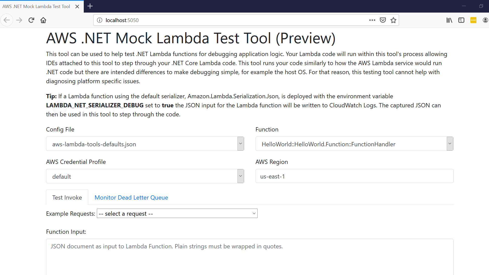
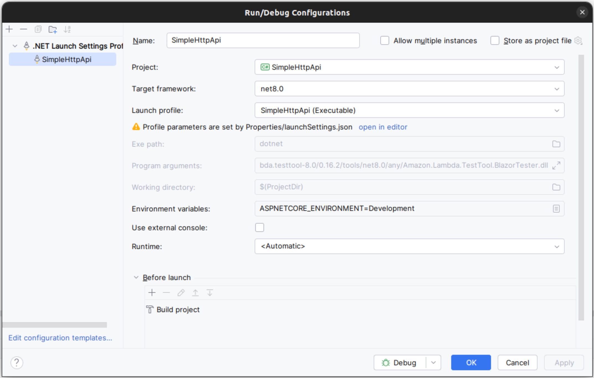
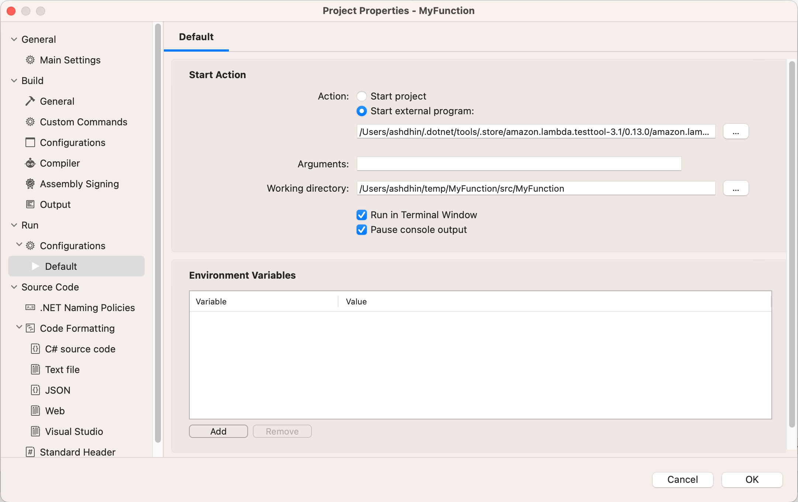

# The AWS .NET Mock Lambda Test Tool (Preview)

The AWS .NET Mock Lambda Test Tool is a tool that can be used to load a .NET Core Lambda project and execute the selected code inside an emulated Lambda environment. An IDE that is attached to the process hosting this tool can then debug and step through the .NET Core Lambda code. The tool is optimized for quick local debugging with minimal dependencies.



**Note:** this tool is not a local Lambda environment. This tool is optimized for quick local debugging with minimal dependencies. For example, the targeted .NET Core Lambda code is run within the process of this tool which is run on the host OS. The host OS is usually Windows or macOS. The host OS is not Amazon Linux, the OS for the Lambda service. Due to these design differences, this tool is not intended to diagnose platform specific issues but instead it can be useful for debugging application logic issues.

- [The AWS .NET Mock Lambda Test Tool (Preview)](#the-aws-net-mock-lambda-test-tool-preview)
  - [Getting help](#getting-help)
  - [Versions of the tool](#versions-of-the-tool)
  - [AWS Credentials](#aws-credentials)
  - [Installing and running](#installing-and-running)
  - [Skip using the web interface](#skip-using-the-web-interface)
  - [Configure for Visual Studio](#configure-for-visual-studio)
  - [Configure for Visual Studio Code](#configure-for-visual-studio-code)
  - [Configure for JetBrains Rider](#configure-for-jetbrains-rider)
  - [Configure for Visual Studio for Mac](#configure-for-visual-studio-for-mac)
  - [Known Limitations](#known-limitations)

## Getting help

This tool is currently in preview and there are some known limitations. For questions and problems please open a GitHub issue in this repository.

## Versions of the tool

There are separate versions of this tool for each support .NET Core Lambda runtime. Currently there are too supported versions .NET Core 2.1
and .NET Core 3.1. When using the AWS [AWS Toolkit for Visual Studio](https://marketplace.visualstudio.com/items?itemName=AmazonWebServices.AWSToolkitforVisualStudio2017)


|.NET Core Version | Tool NuGet Package | Tool executable|
|------------------|--------------------|----------------|
| .NET Core 2.1 | Amazon.Lambda.TestTool-2.1 | dotnet-lambda-test-tool-2.1.exe |
| .NET Core 3.1 | Amazon.Lambda.TestTool-3.1 | dotnet-lambda-test-tool-3.1.exe |

## AWS Credentials

In the Lambda environment an IAM Role is assigned to the function that delivers AWS Credentials to the Lambda compute environment. When 
service clients from the AWS SDK for .NET are created without explicit credentials the SDK will search the running environment for 
credentials and find the credentials delivered by the IAM role.

IAM Roles are **not** used with this tool. Instead a credential profile is selected from the host machine's credential before the code is 
run. The **AWS_PROFILE** environment variable is set to the selected profile. Just like in the Lambda environment when a service client 
is created without explicit credentials the SDK searches for credentials and will find the AWS_PROFILE environment variable and retrieve the 
credentials from the local credential file.

## Installing and running

The tool is distributed as .NET Global Tools via the NuGet packages. There is a package for each Lambda runtime supported which the table above describes. 
The suffix of each package indicates the version of .NET Core the package is for. To install the tool execute the following command:

```
dotnet tool install -g Amazon.Lambda.TestTool-3.1
```

To update the tool run the following command:

```
dotnet tool update -g Amazon.Lambda.TestTool-3.1
```

The main intention for this tool is to make it easy to debug .NET Core Lambda code from an IDE. The tool can be run without an IDE by executing the following command from the project directory. The .NET Core Lambda project **must be built for debug** before running this tool. It doesn't do this automatically because it is assumed an IDE will have built the project before executing this program.

```
dotnet lambda-test-tool-3.1
```

## Skip using the web interface

In the default mode this tool uses the web interface to select the .NET Lambda code to run. It is also possible to skip using the web interface and identify the .NET Lambda code to run
using command line arguments. The key command line argument to set is <b>--no-ui</b> which will turn off the web interface. Using the <b>--help</b> command line argument you can see the list of
arguments that can be used to identify the .NET Lambda code and set environment settings like aws profile and region as well as a payload JSON document to be used as the function input.

<pre style="white-space: pre-wrap; background-color:lightgray;font-size:85%">
&gt; dotnet lambda-test-tool-3.1 --help
AWS .NET Core 3.1 Mock Lambda Test Tool (0.10.0)

The .NET Lambda Test Tool can be launched in 2 modes. The default mode is to launch a web interface to select the Lambda code
to execute with in the Lambda test tool. The second mode skips using the web interface and the Lambda code is identified
using the commandline switches as described below. To switch to the no web interface mode use the --no-ui command line switch.

These options are valid for either mode the Lambda test tool is running in.

        --path &lt;directory&gt;                    The path to the lambda project to execute. If not set then the current directory will be used.

These options are valid when using the web interface to select and execute the Lambda code.

        --port &lt;port-number&gt;                  The port number used for the test tool's web interface.
        --no-launch-window                    Disable auto launching the test tool's web interface in a browser.

These options are valid in the no web interface mode.

        --no-ui                               Disable launching the web interface and immediately execute the Lambda code.
        --profile &lt;profile-name&gt;              Set the AWS credentials profile to provide credentials to the Lambda code.
                                              If not set the profile from the config file will be used.
        --region &lt;region-name&gt;                Set the AWS region to as the default region for the Lambda code being executed.
                                              If not set the region from the config file will be used.
        --config-file &lt;file-name&gt;             The config file to read for Lambda settings. If not set than aws-lambda-tools-defaults.json
                                              will be used.
        --function-handler &lt;handler-string&gt;   The Lambda function handler to identify the code to run. If not set then the function handler
                                              from the config file will be used. This is the format of &lt;assembly::type-name::method-name&gt;.
        --payload &lt;file-name&gt;                 The JSON payload to send to the Lambda function. This can be either an inline string or a
                                              file path to a JSON file.
        --pause-exit &lt;true or false&gt;          If set to true the test tool will pause waiting for a key input before exiting. The is useful
                                              when executing from an IDE so you can avoid having the output window immediately disappear after
                                              executing the Lambda code. The default value is true.
</pre>

For command line arguments not set the defaults and config file will be used to determine the .NET Lambda code to run. For example if you just use the <b>--no-ui</b> argument then the
<b>aws-lambda-tools-defaults.json</b> will be searched for and used if found. The tool when then use the function handler, profile and region specified in the configuration file to run
.NET Lambda code.

Here is an example of a <b>launchSettings.json</b> file configured to use this tool without the web interface. Only <b>--no-ui</b> and <b>--payload</b> are set turning off the web interface
and indicating the contents of the payload.json file should be used as the function input. The function handler is identified from the project's <b>aws-lambda-tools-defaults.json</b> file.

<pre style="white-space: pre-wrap; background-color:lightgray;font-size:85%">
{
  "profiles": {
    "Mock Lambda Test Tool": {
      "commandName": "Executable",
      "commandLineArgs": "--no-ui --payload payload.json",
      "workingDirectory": ".\\bin\\$(Configuration)\\netcoreapp3.1",
      "executablePath": "C:\\Users\\%USERNAME%\\.dotnet\\tools\\dotnet-lambda-test-tool-3.1.exe"
    }
  }
}
</pre>

## Configure for Visual Studio

With the latest version of the [AWS Toolkit for Visual Studio](https://marketplace.visualstudio.com/items?itemName=AmazonWebServices.AWSToolkitforVisualStudio2017) the .NET Mock Lambda Test Tool will be automatically installed/updated and configured as a debug profile when you open a .NET Core Lambda project. The goal is to be able to open a .NET Core Lambda project in Visual Studio and just push **F5** to start debugging without any dependencies other than the AWS Toolkit for Visual Studio.

When a project is opened in Visual Studio the toolkit will detect the project is a Lambda project by looking for the `<AWSProjectType>Lambda</AWSProjectType>` property in the project file. If found it will write a `launchSettings.json` file in the .NET Core Lambda project's `Properties` folder. Visual Studio uses this file to look for debug profiles.
```json
{
  "profiles": {
    "Mock Lambda Test Tool": {
      "commandName": "Executable",
      "commandLineArgs": "--port 5050",
      "executablePath": "<home-directory>\\.dotnet\\tools\\dotnet-lambda-test-tool-3.1.exe",
      "workingDirectory": ".\\bin\\Debug\\netcoreapp3.1"
    }
  }
}
```


## Configure for Visual Studio Code

Before using Visual Studio Code you must follow the instructions above on installing the .NET Mock Lambda Test Tool.

To debug with Visual Studio Code and the .NET Mock Lambda Test Tool edit the [launch.json](https://code.visualstudio.com/docs/editor/debugging#_launch-configurations) configuration file and have the `program` property point to `dotnet-lambda-test-tool-3.1.exe` and make sure `cwd` is pointing the .NET Core Lambda project. Note that on a non-windows environment the executable will be called `dotnet-lambda-test-tool-3.1` without the ".exe" at the end. The `dotnet-lambda-test-tool-3.1.exe` executable can be found in the `.dotnet/tools` directory under your home directory. Depending on your file system settings, the `.dotnet` directory can appear hidden.

```json
{
    "version": "0.2.0",
    "configurations": [
        {
            "name": ".NET Core Launch (console)",
            "type": "coreclr",
            "request": "launch",
            "preLaunchTask": "build",
            "program": "<home-directory>/.dotnet/tools/dotnet-lambda-test-tool-3.1.exe",
            "args": [],
            "cwd": "${workspaceFolder}",
            "console": "internalConsole",
            "stopAtEntry": false,
            "internalConsoleOptions": "openOnSessionStart"
        },
```

To customize the launch behavior for the debugger, you can pass additional arguments via the `args` property:

| Name             | Default Value             | Example                                     |
| ---------------- | ------------------------- | ------------------------------------------- |
| port             | 5050                      | `["--port", "5001"`]                        |
| suppress browser | False                     | `["--no-launch-window", "true"`]            |
| path             | Current working directory | `["--path", "C:\\different\\launch\\path"]` |

## Configure for JetBrains Rider

Before using JetBrains Rider you must follow the instructions above on installing the .NET Mock Lambda Test Tool.

Configuring  Rider to use the .NET Mock Lambda Test Tool is a little different compared to Visual Studio. For Rider the executable target needs to be the entry assembly for the Test Tool and **not** the Global Tool executable. For .NET Core 3.1 the entry assembly is `Amazon.Lambda.TestTool.WebTester31.dll` and for .NET Core 2.1 the entry assembly is `Amazon.Lambda.TestTool.WebTester21.dll`.  

The path to the .NET Core 3.1 entry assembly is:

```
<home-directory>/.dotnet/tools/.store/amazon.lambda.testtool-3.1/<nuget-version>/amazon.lambda.testtool-3.1/<nuget-version>/tools/netcoreapp3.1/any/Amazon.Lambda.TestTool.WebTester31.dll
```

For .NET Core 2.1 the path is:
```
<home-directory>/.dotnet/tools/.store/amazon.lambda.testtool-2.1/<nuget-version>/amazon.lambda.testtool-2.1/<nuget-version>/tools/netcoreapp2.1/any/Amazon.Lambda.TestTool.WebTester21.dll
```


Remember when you update your version of the .NET Mock Lambda Test Tool to update the nuget versions numbers in this path string for your IDE's configuration.

**Note**: if using the .NET Core Mock Lambda Test Tool **3.1** version **0.11.0**, you will need to use the BlazorTester DLL (`Amazon.Lambda.TestTool.BlazorTester.dll`) and set the `Exe path` to the full path of the BlazorTester DLL. This applies to .NET Core 3.1

Follow the following steps to configure Rider
* Select Run->Edit Configurations...
* Push the `+` button to add a configuration and select `.NET Executable`
* Set the `Exe path` field to the full path of `Amazon.Lambda.TestTool.WebTesterXX.dll` as described above
* Set the `Working directory` field to the .NET Core Lambda project root
* Push OK

After following these steps, any time you start the debugger in Rider, it will subsequently launch the .NET Mock Lambda Test Tool.



## Configure for Visual Studio for Mac

Before using Visual Studio for Mac you must follow the instructions above on installing the .NET Mock Lambda Test Tool.

Configuring Visual Studio for Mac to use the .NET Mock Lambda Test Tool is a little different compared to Visual Studio. For Visual Studio for Mac the executable target needs to be the entry assembly for the Test Tool and **not** the Global Tool executable. For .NET Core 3.1 the entry assembly is `Amazon.Lambda.TestTool.WebTester31.dll` and for .NET Core 2.1 the entry assembly is `Amazon.Lambda.TestTool.WebTester21.dll`.  

The path to the .NET Core 3.1 entry assembly is:

```
<home-directory>/.dotnet/tools/.store/amazon.lambda.testtool-3.1/<nuget-version>/amazon.lambda.testtool-3.1/<nuget-version>/tools/netcoreapp3.1/any/Amazon.Lambda.TestTool.WebTester31.dll
```

For .NET Core 2.1 the path is:
```
<home-directory>/.dotnet/tools/.store/amazon.lambda.testtool-2.1/<nuget-version>/amazon.lambda.testtool-2.1/<nuget-version>/tools/netcoreapp2.1/any/Amazon.Lambda.TestTool.WebTester21.dll
```

Remember when you update your version of the .NET Mock Lambda Test Tool to update the nuget versions numbers in this path string for your IDE's configuration.

Follow these steps to configure Visual Studio for Mac:

* Right click on .NET Core Lambda Project and select `Options`
* Select the node Run -> Configurations -> Default
* Set the `Start external program` field to the full path of `Amazon.Lambda.TestTool.WebTesterXX.dll` as described above
* Set the `Run in directory` field to the .NET Core Lambda project root

Once this is done when you start the debugger in Visual Studio for Mac it will launch the .NET Mock Lambda Test Tool.



## Known Limitations

* No mechanism for setting custom Environment variables.
* NuGet packages that use native dependencies are not supported.
