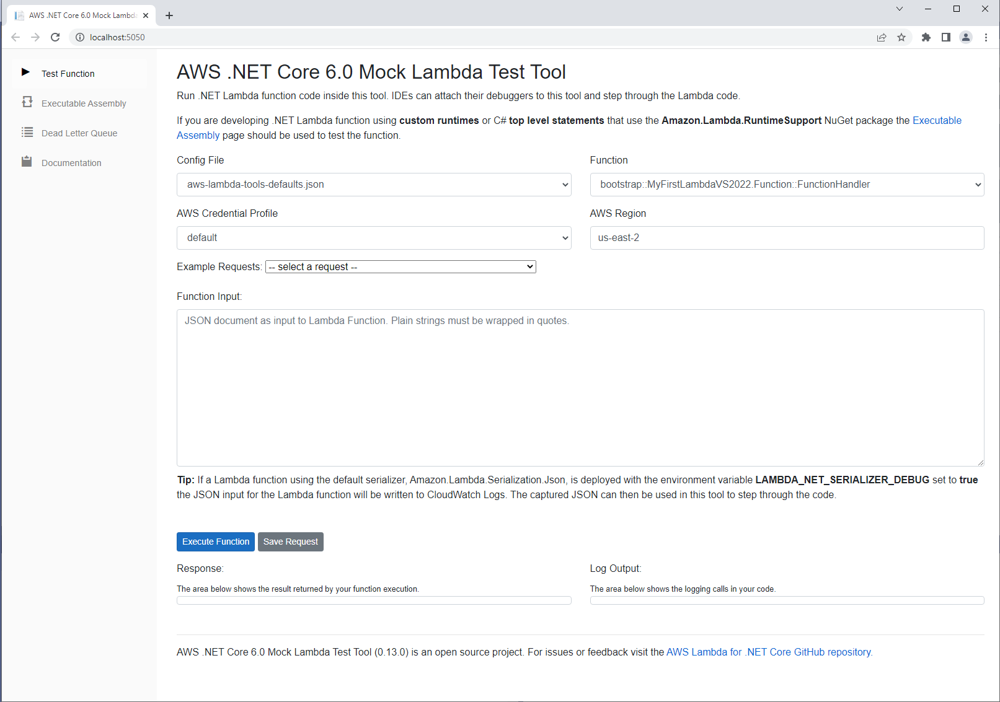

# The AWS .NET Mock Lambda Test Tool (Preview)

The AWS .NET Mock Lambda Test Tool is a tool that can be used to load a .NET Core Lambda project and execute the selected code inside an emulated Lambda environment. An IDE that is attached to the process hosting this tool can then debug and step through the .NET Core Lambda code. The tool is optimized for quick local debugging with minimal dependencies.



**Note:** this tool is not a local Lambda environment. This tool is optimized for quick local debugging with minimal dependencies. For example, the targeted .NET Core Lambda code is run within the process of this tool which is run on the host OS. The host OS is usually Windows or macOS. The host OS is not Amazon Linux, the OS for the Lambda service. Due to these design differences, this tool is not intended to diagnose platform specific issues but instead it can be useful for debugging application logic issues.

- [Getting Started](#getting-help)
- [Installing and Running](#installing-and-running)
- [Configure for Visual Studio](#configure-for-visual-studio)
- [Configure for Visual Studio Code](#configure-for-visual-studio-code)
- [Configure for JetBrains Rider](#configure-for-jetbrains-rider)
- [Configure for Visual Studio for Mac](#configure-for-visual-studio-for-mac)
- [Known Limitations](#known-limitations)

## Getting Help

This tool is currently in preview and there are some known limitations. For questions and problems please open a GitHub issue in this repository.

## AWS Credentials

In the Lambda environment an IAM Role is assigned to the function that delivers AWS Credentials to the Lambda compute environment. When service clients from the AWS SDK for .NET are created without explicit credentials the SDK will search the running environment for credentials and find the credentials delivered by the IAM role.

IAM Roles are **not** used with this tool. Instead a credential profile is selected from the host machine's credential before the code is run. The **AWS_PROFILE** environment variable is set to the selected profile. Just like in the Lambda environment when a service client is created without explicit credentials the SDK searches for credentials and will find the AWS_PROFILE environment variable and retrieve the credentials from the local credential file.

## Installing and Running

The tool is distributed as a .NET Global Tool via the NuGet package Amazon.Lambda.TestTool-2.1. To install the tool execute the following command:

```
dotnet tool install -g Amazon.Lambda.TestTool-2.1
```

To update the tool run the following command:

```
dotnet tool update -g Amazon.Lambda.TestTool-2.1
```

The main intention for this tool is to make it easy to debug .NET Core Lambda code from an IDE. The tool can be run without an IDE by executing the following command from the project directory. The .NET Core Lambda project **must be built for debug** before running this tool. It doesn't do this automatically because it is assumed an IDE will have built the project before executing this program.

```
dotnet lambda-test-tool-2.1
```


### Why the 2.1 Suffix?

Since this tool loads .NET Core Lambda code within its process the version of .NET Core must match the target Lambda Runtime, which is .NET Core 2.1 in this case. When future .NET Core Lambda environments become available a new NuGet package will be released with the suffix updated to match the target framework.


## Configure for Visual Studio

With the latest version of the [AWS Toolkit for Visual Studio](https://marketplace.visualstudio.com/items?itemName=AmazonWebServices.AWSToolkitforVisualStudio2017) the .NET Mock Lambda Test Tool will be automatically installed/updated and configured as a debug profile when you open a .NET Core Lambda project. The goal is to be able to open a .NET Core Lambda project in Visual Studio and just push **F5** to start debugging without any dependencies other than the AWS Toolkit for Visual Studio.

When a project is opened in Visual Studio the toolkit will detect the project is a Lambda project by looking for the `<AWSProjectType>Lambda</AWSProjectType>` property in the project file. If found it will write a `launchSettings.json` file in the .NET Core Lambda project's `Properties` folder. Visual Studio uses this file to look for debug profiles.
```json
{
  "profiles": {
    "Mock Lambda Test Tool": {
      "commandName": "Executable",
      "commandLineArgs": "--port 5050",
      "executablePath": "<home-directory>\\.dotnet\\tools\\dotnet-lambda-test-tool-2.1.exe",
      "workingDirectory": ".\\bin\\Debug\\netcoreapp2.1"
    }
  }
}
```


## Configure for Visual Studio Code

Before using Visual Studio Code you must follow the instructions above on installing the .NET Mock Lambda Test Tool.

To debug with Visual Studio Code and the .NET Mock Lambda Test Tool edit the [launch.json](https://code.visualstudio.com/docs/editor/debugging#_launch-configurations) configuration file and have the `program` property point to `dotnet-lambda-test-tool-2.1.exe` and make sure `cwd` is pointing the .NET Core Lambda project. Note that on a non-windows environment the executable will be called `dotnet-lambda-test-tool-2.1` without the ".exe" at the end. The `dotnet-lambda-test-tool-2.1.exe` executable can be found in the `.dotnet/tools` directory under your home directory. Depending on your file system settings, the `.dotnet` directory can appear hidden.

```json
{
    "version": "0.2.0",
    "configurations": [
        {
            "name": "Mock Lambda Test Tool",
            "type": "coreclr",
            "request": "launch",
            "preLaunchTask": "build",
            "program": "<home-directory>/.dotnet/tools/dotnet-lambda-test-tool-2.1.exe",
            "args": [],
            "cwd": "${workspaceFolder}\\bin\\Debug\\netcoreapp2.1",
            "console": "internalConsole",
            "stopAtEntry": false,
            "internalConsoleOptions": "openOnSessionStart"
        },
```

To customize the launch behavior for the debugger, you can pass additional arguments via the `args` property:

| Name             | Default Value             | Example                                     |
| ---------------- | ------------------------- | ------------------------------------------- |
| port             | 5050                      | `["--port", "5001"`]                        |
| suppress browser | False                     | `["--no-launch-window", "true"`]            |
| path             | Current working directory | `["--path", "C:\\different\\launch\\path"]` |

## Configure for JetBrains Rider

Before using JetBrains Rider you must follow the instructions above on installing the .NET Mock Lambda Test Tool.

Configuring  Rider to use the .NET Mock Lambda Test Tool is a little different compared to Visual Studio. For Rider the executable target needs to be the main assembly `Amazon.Lambda.TestTool.dll` for the Test Tool and **not** the Global Tool executable `dotnet-lambda-test-tool-2.1`. The path to `Amazon.Lambda.TestTool.dll` is:

```
<home-directory>/.dotnet/tools/.store/amazon.lambda.testtool-2.1/<nuget-version>/amazon.lambda.testtool-2.1/<nuget-version>/tools/netcoreapp2.1/any/Amazon.Lambda.TestTool.dll
```

Remember when you update your version of the .NET Mock Lambda Test Tool to update the nuget versions numbers in this path string for your IDE's configuration.

Follow the following steps to configure Rider
* Select Run->Edit Configurations...
* Push the `+` button to add a configuration and select `.NET Executable`
* Set the `Exe path` field to the full path of `Amazon.Lambda.TestTool.dll` as described above
* Set the `Working directory` field to the .NET Core Lambda project root
* Push OK

After following these steps, any time you start the debugger in Rider, it will subsequently launch the .NET Mock Lambda Test Tool.


## Configure for Visual Studio for Mac

Before using Visual Studio for Mac you must follow the instructions above on installing the .NET Mock Lambda Test Tool.

Configuring Visual Studio for Mac to use the .NET Mock Lambda Test Tool is a little different compared to Visual Studio. For Visual Studio for Mac the executable target needs to be the main assembly `Amazon.Lambda.TestTool.dll` for the Test Tool and **not** the Global Tool executable `dotnet-lambda-test-tool-2.1`. The path to `Amazon.Lambda.TestTool.dll` is:

```
<home-directory>/.dotnet/tools/.store/amazon.lambda.testtool-2.1/<nuget-version>/amazon.lambda.testtool-2.1/<nuget-version>/tools/netcoreapp2.1/any/Amazon.Lambda.TestTool.dll
```
Remember when you update your version of the .NET Mock Lambda Test Tool to update the nuget versions numbers in this path string for your IDE's configuration.

Follow these steps to configure Visual Studio for Mac:

* Right click on .NET Core Lambda Project and select `Options`
* Select the node Run -> Configurations -> Default
* Set the `Start external program` field to the full path of `Amazon.Lambda.TestTool.dll` as described above
* Set the `Run in directory` field to the .NET Core Lambda project root

Once this is done when you start the debugger in Visual Studio for Mac it will launch the .NET Mock Lambda Test Tool.


## Known Limitations

* YAML based CloudFormation templates are not yet supported.
* No mechanism for setting custom Environment variables.
* NuGet packages that use native dependencies are not supported.
